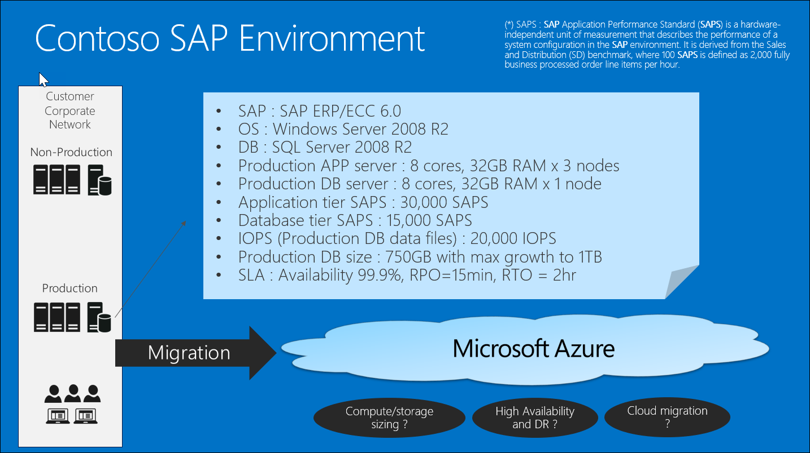
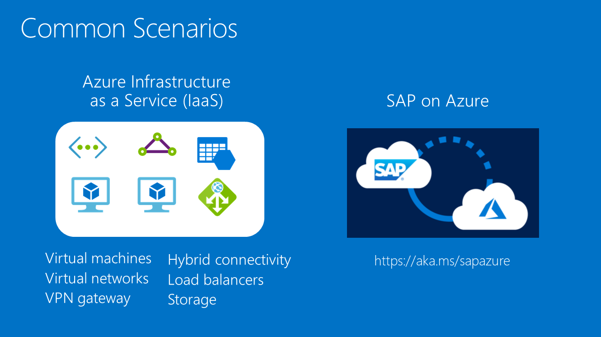
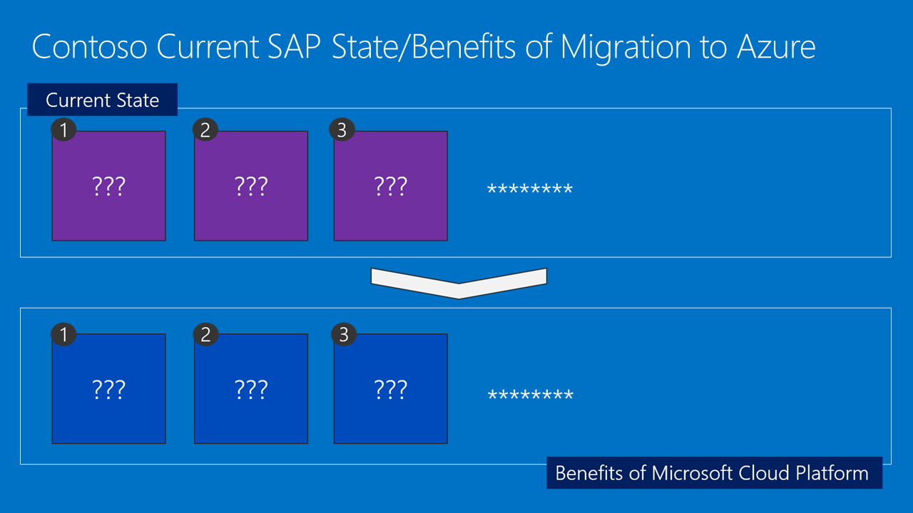
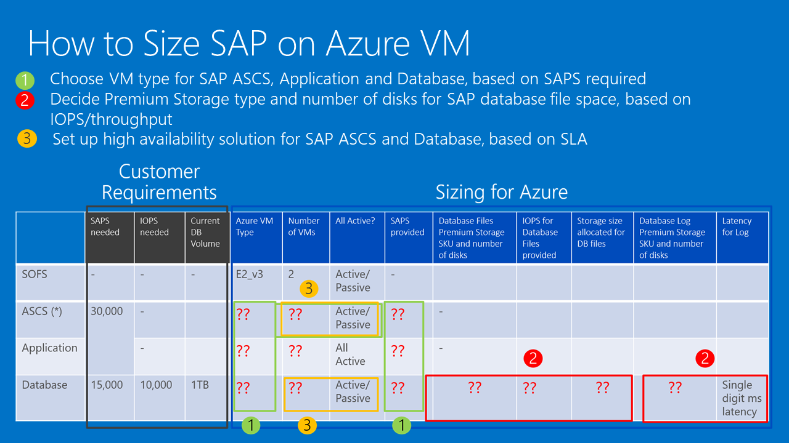
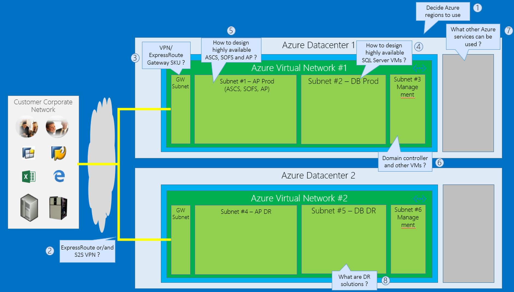
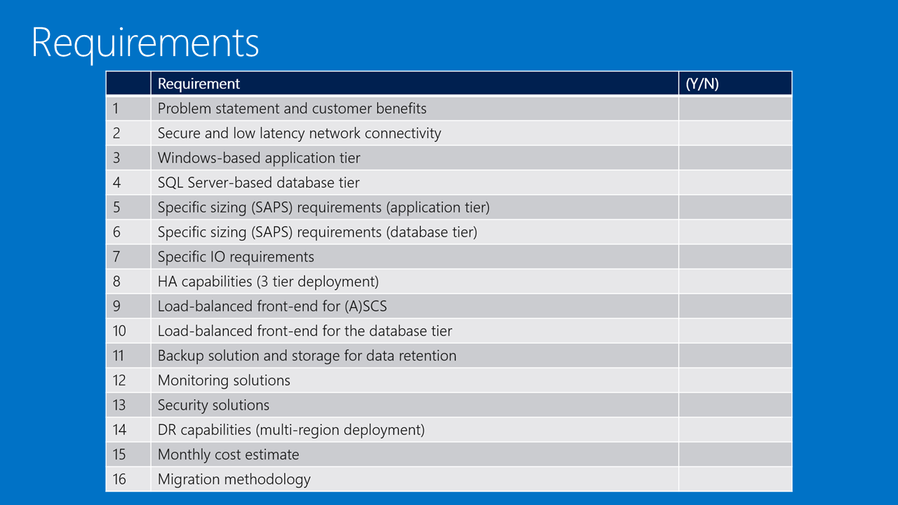
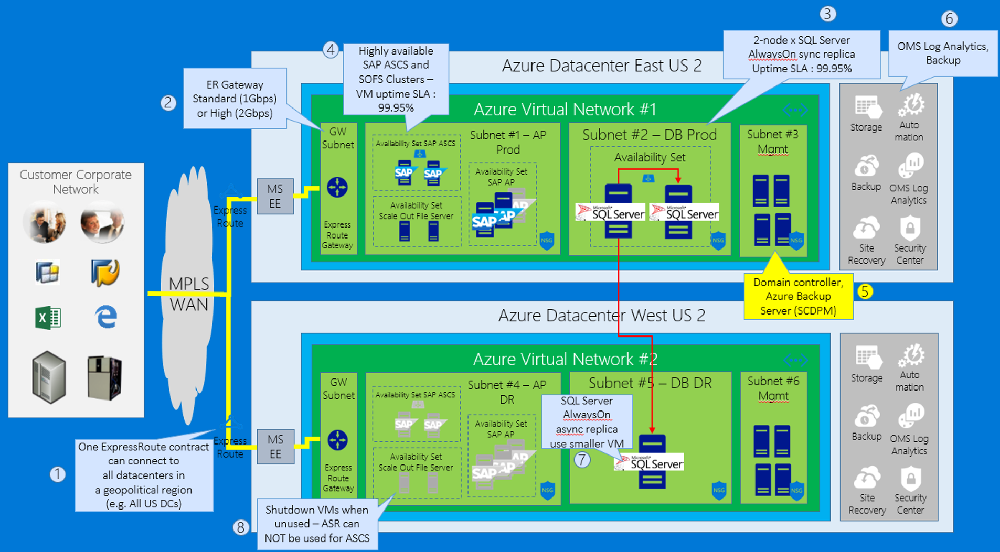
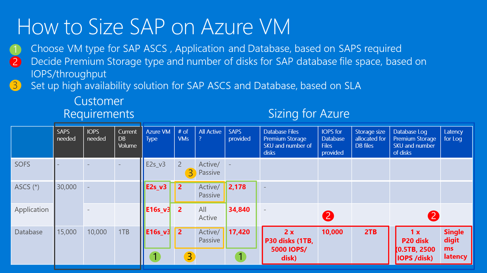
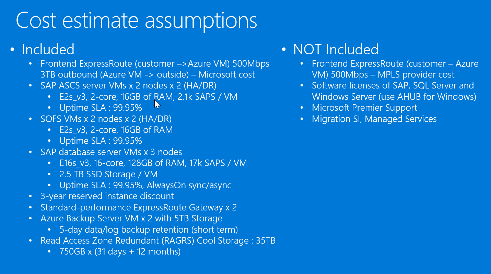
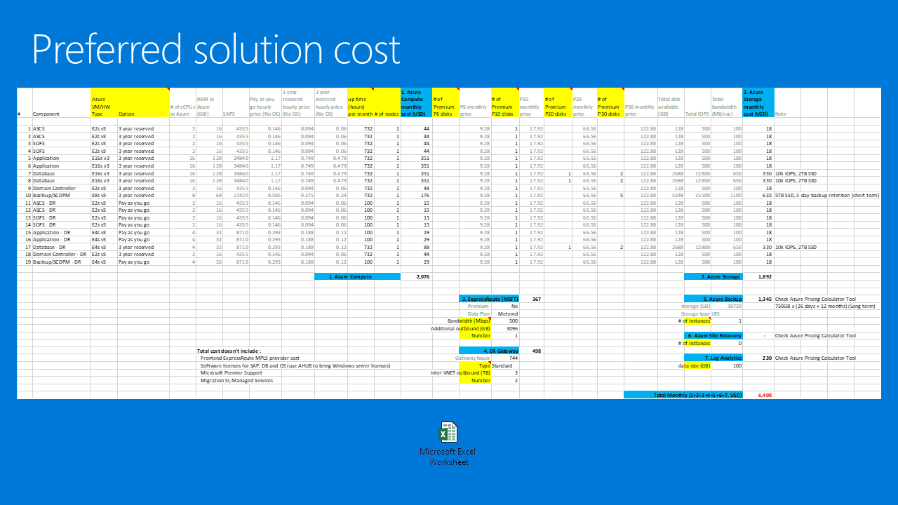

SAP NetWeaver on Azure

 Whiteboard design session trainer guide

March 2018

Information in this document, including URL and other Internet Web site references, is subject to change without notice. Unless otherwise noted, the example companies, organizations, products, domain names, e-mail addresses, logos, people, places, and events depicted herein are fictitious, and no association with any real company, organization, product, domain name, e-mail address, logo, person, place or event is intended or should be inferred. Complying with all applicable copyright laws is the responsibility of the user. Without limiting the rights under copyright, no part of this document may be reproduced, stored in or introduced into a retrieval system, or transmitted in any form or by any means (electronic, mechanical, photocopying, recording, or otherwise), or for any purpose, without the express written permission of Microsoft Corporation.

Microsoft may have patents, patent applications, trademarks, copyrights, or other intellectual property rights covering subject matter in this document. Except as expressly provided in any written license agreement from Microsoft, the furnishing of this document does not give you any license to these patents, trademarks, copyrights, or other intellectual property.

The names of manufacturers, products, or URLs are provided for informational purposes only and Microsoft makes no representations and warranties, either expressed, implied, or statutory, regarding these manufacturers or the use of the products with any Microsoft technologies. The inclusion of a manufacturer or product does not imply endorsement of Microsoft of the manufacturer or product. Links may be provided to third party sites. Such sites are not under the control of Microsoft and Microsoft is not responsible for the contents of any linked site or any link contained in a linked site, or any changes or updates to such sites. Microsoft is not responsible for webcasting or any other form of transmission received from any linked site. Microsoft is providing these links to you only as a convenience, and the inclusion of any link does not imply endorsement of Microsoft of the site or the products contained therein.

© 2018 Microsoft Corporation. All rights reserved.

Microsoft and the trademarks listed at <https://www.microsoft.com/en-us/legal/intellectualproperty/Trademarks/Usage/General.aspx> are trademarks of the Microsoft group of companies. All other trademarks are property of their respective owners.

**Contents**
<!-- TOC -->

- [Trainer information](#trainer-information)
    - [Role of the trainer](#role-of-the-trainer)
    - [Whiteboard design session flow](#whiteboard-design-session-flow)
    - [Before the whiteboard design session: How to prepare](#before-the-whiteboard-design-session-how-to-prepare)
    - [During the whiteboard design session: Tips for an effective whiteboard design session](#during-the-whiteboard-design-session-tips-for-an-effective-whiteboard-design-session)
- [SAP on Azure whiteboard design session student guide](#sap-on-azure-whiteboard-design-session-student-guide)
    - [Abstract and learning objectives](#abstract-and-learning-objectives)
    - [Step 1: Review the customer case study](#step-1-review-the-customer-case-study)
        - [Customer situation](#customer-situation)
        - [Customer needs](#customer-needs)
        - [Technical Requirements](#technical-requirements)
        - [Customer objections](#customer-objections)
        - [Infographic for common scenarios](#infographic-for-common-scenarios)
    - [Step 2: Design a proof of concept solution](#step-2-design-a-proof-of-concept-solution)
        - [*Architecting network connectivity*](#architecting-network-connectivity)
        - [*Architecting (ASCS) components*](#architecting-ascs-components)
        - [*Architecting application components*](#architecting-application-components)
        - [*Architecting database components*](#architecting-database-components)
        - [*Determining estimated cost of the solution*](#determining-estimated-cost-of-the-solution)
    - [Step 3: Present the solution](#step-3-present-the-solution)
    - [Wrap-up](#wrap-up)
        - [Additional references](#additional-references)
- [SAP on Azure whiteboard design session trainer guide](#sap-on-azure-whiteboard-design-session-trainer-guide)
    - [Step 1: Review the customer case study](#step-1-review-the-customer-case-study-1)
    - [Step 2: Design a proof of concept solution](#step-2-design-a-proof-of-concept-solution-1)
    - [Step 3: Present the solution](#step-3-present-the-solution-1)
    - [Wrap-up](#wrap-up-1)
    - [Preferred target audience](#preferred-target-audience)
    - [Preferred solution](#preferred-solution)
    - [Checklist of preferred objection handling](#checklist-of-preferred-objection-handling)
    - [Customer quote (to be read back to the attendees at the end)](#customer-quote-to-be-read-back-to-the-attendees-at-the-end)

<!-- /TOC -->

# Trainer information

Thank you for taking time to support the whiteboard design sessions as a trainer!

## Role of the trainer

An amazing trainer:

-   Creates a safe environment in which learning can take place.

-   Stimulates the participant's thinking.

-   Involves the participant in the learning process.

-   Manages the learning process (on time, on topic, and adjusting to benefit participants).

-   Ensures individual participant accountability.

-   Ties it all together for the participant.

-   Provides insight and experience to the learning process.

-   Effectively leads the whiteboard design session discussion.

-   Monitors quality and appropriateness of participant deliverables.

-   Effectively leads the feedback process.

## Whiteboard design session flow 

Each whiteboard design session uses the following flow:

**Step 1: Review the customer case study (15 minutes)**

Outcome: Analyze your customer's needs

-   Customer's background, situation, needs and technical requirements

-   Current customer infrastructure and architecture

-   Potential issues, objectives and blockers

**Step 2: Design a proof of concept solution (60 minutes)**

Outcome: Prepare to present a solution for your target customer audience

-   Determine your target customer audience

-   Determine customer's business needs to address your solution

-   Design and diagram your solution

-   Prepare to present your solution

**Step 3: Present the solution (30 minutes)**

Outcome: Present solution to your customer

-   Present solution

-   Respond to customer objections

-   Receive feedback

**Wrap-up (15 minutes)**

-   Review preferred solution

## Before the whiteboard design session: How to prepare

Before conducting your first whiteboard design session:

-   Read the Student guide (including the case study) and Trainer guide

-   Become familiar with all key points and activities.

-   Plan the point you want to stress, which questions you want to drive, transitions, and be ready to answer questions.

-   Prior to the whiteboard design session, discuss the case study to pick up more ideas.

-   Make notes for later.

## During the whiteboard design session: Tips for an effective whiteboard design session

**Refer to the Trainer guide** to stay on track and observe the timings.

**Do not expect to memorize every detail** of the whiteboard design session.

When participants are doing activities, you can **look ahead to refresh your memory**.

-   **Adjust activity and whiteboard design session pace** as needed to allow time for presenting, feedback, and sharing.

-   **Add examples, points, and stories** from your own experience. Think about stories you can share that help you make your points clearly and effectively.

-   **Consider creating a "parking lot"** to record issues or questions raised that are outside the scope of the whiteboard design session or can be answered later. Decide how you will address these issues, so you can acknowledge them without being derailed by them.

***Have fun**! Encourage participants to have fun and share!*

**Involve your participants.** Talk and share your knowledge but always involve your participants, even while you are the one speaking.

**Ask questions** and get them to share to fully involve your group in the learning process.

**Ask first**, whenever possible. Before launching into a topic, learn your audience's opinions about it and experiences with it. Asking first enables you to assess their level of knowledge and experience and leaves them more open to what you are presenting.

**Wait for responses**. If you ask a question such as, "What is your experience with (fill in the blank)?" then wait. Do not be afraid of a little silence. If you leap into the silence, your participants will feel you are not serious about involving them and will become passive. Give participants a chance to think, and if no one answers, patiently ask again. You will usually get a response.

#  SAP on Azure whiteboard design session student guide

## Abstract and learning objectives 

Deploy and configure SAP on Azure infrastructure and SAP NetWeaver deployment running on Azure infrastructure, including SAP NetWeaver ASCS and SAP NetWeaver database servers. Key takeaways are the Azure infrastructure solution components and the way they are put together to run SAP applications as well as the Solution architecture references.

Attendees will be better able to deploy SAP on Azure infrastructure components as well as the following tasks:

-   Perform a SAP on Azure need assessment

-   Take part in SAP on Azure Architecture Design Discussion

-   Respond to RFI/RFP for SAP on Cloud opportunity

## Step 1: Review the customer case study 

**Outcome** 

Analyze your customer’s needs.
Time frame: 15 minutes 
Directions: With all participants in the session, the facilitator/SME presents an overview of the customer case study along with technical tips. 
1.  Meet your table participants and trainer 
2.  Read all of the directions for steps 1–3 in the student guide 
3.  As a table team, review the following customer case study

### Customer situation

Contoso Group is a US-based telecommunications company with worldwide operations serving almost 150 million mobile subscribers. The company is looking to optimize its IT environment and considering moving some of its on-premises SAP workloads to Azure.

Contoso Group has an existing on-premises deployment of SAP ECC (SAP ERP Central Component) 6.0 on Windows Server 2012 R2 with a SQL Server 2014 database in its US-based data center near New York City. The deployment consists of the development, test, quality assurance, and production systems. However, the IT organization finds it challenging to expand the SAP landscape to accommodate growing number of SAP-related business requests. This is related to the time and resources required to move through development and testing phases and implement new business processes into production. In addition, IT finds it difficult to adjust the size of the production environment in order to accommodate varying level of workloads. IT is also concerned about lack of high availability and disaster recovery capabilities in the existing deployment. The estimates of providing such capabilities for production workloads exceed by far the budget allocated for this purpose.

As the result, agility of the organization is hampered by capital expenditures and time necessary to acquire and provision project-related SAP development and testing environments. Representatives of central IT management, including the company CIO Andrew Cross and its VP of IT Operations are concerned about managing test/dev infrastructure costs. There are also concerns regarding aging data center and hardware. Business Development Manager (BDM) and the company CFO would like to lower TCO for the SAP landscape, including the production ECC environment.

**Current situation**

The production app tier consists of three physical servers, each with 8 CPU cores and 32GB RAM. The production database tier is hosted on a single physical server with the same hardware configuration. The average performance of the application tier and the database tier is about 30,000 SAPS and 15,000 SAPS, respectively. The production SAP database workload generates about 10,000 IOPS. The current production DB size is 750GB. According to the estimates of the Contoso SAP team, the database is bound to grow to about 1TB in the next few years. In case of a disaster affecting the production instance, the business expects the RPO and RTO of 15 minutes and 6 hours, respectively. The database transaction log backup should be performed very 15 minutes, with one full daily backup. Daily full backups must be retained for 1 month and monthly full backups for 1 year.

**Customer Objectives**

As Andrew Cross, the company's CIO wants to significantly improve times it takes to provision development and test SAP environments. At the same time, he stresses the importance of minimizing their cost. He also points out the criticality of the SAP production workloads and the need of protecting them against unplanned downtime. As he stated, "The existing on-premises SAP development and test environments no longer meet the agility required by the fast pace of changes in our business. In addition, our operational dependencies on SAP applications force us to seek reasonably priced availability and disaster recovery capabilities for our production SAP deployments".

Contoso CIO and the company CFO, along with Business Development Manager (BDM), Director of SAP Business Analysts, and Director of SAP Operations are all open to taking advantage of Azure as a platform and want their respective teams to be able to leverage the scalability and resiliency provided by the cloud platform.

**Existing Contoso SAP environment**

### Customer needs 

-   Reduce time to deploy new business processes to have competitive customer offers

-   Reduce time required to provision development and test environments

-   Lower costs incurred by the development, test, and production environments

-   Identify an estimated monthly infrastructure cost for operating your solution

### Technical Requirements

-   SAP ERP/ECC 6.0 NetWeaver is the application tier

-   SQL Server 2014 is the data tier

-   Application tier on the production system requires total of 30,000 SAPS

-   Database tier on the production system requires total of 15,000 SAPS

-   Database tier on the production system needs 10,000 IOPS

-   The size of database files on the production system is 750GB, with the expected growth to 1TB

-   RPO=15 min, RTO=6 hours

-   Transaction log backups every 15 minutes, full daily backups retained for 1-month, monthly backups retained for 1 year

### Customer objections 

-   If I have already paid for my hardware to run my dev/test environment, how am I getting any cost savings by moving it to Azure? How much more is your cloud solution costing me?

-   What if I need my cloud resources to access on-premises resources?

-   Will Azure meet our security and compliance requirements?

-   Do I have to pay for resources when they are stopped?

-   For my dev environment, can I automate scheduled daily shutdown?

### Infographic for common scenarios

## Step 2: Design a proof of concept solution

**Outcome** 
Design a solution and prepare to present the solution to the target customer audience in a 15-minute chalk-talk format. 

Time frame: 60 minutes

**Business needs**

Directions: With all participants at your table, answer the following questions and list the answers on a flip chart. 
1.  Who should you present this solution to? Who is your target customer audience? Who are the decision makers? 
2.  What customer business needs do you need to address with your solution?

**Design** 
Directions: With all participants at your table, respond to the following questions on a flip chart.

***Architecting a multi-tier SAP solution***

Using the features of Azure and the requirements from the customer, design the application infrastructure and network for A Datum SAP deployment in Azure. Consider such factors as cost of ownership of entire SAP landscape as well as availability and disaster recovery capabilities for the production environment.

Make sure that your design covers the following items:

***High-level architecture***

**Task:** Identifying the target Azure region(s) and the number of tiers

-   Identify the optimal choices for Azure region(s) where the solution should be deployed.

-   Choose between the 2-tier and 3-tier architecture.

-   Ensure that high-availability and disaster recovery requirements are satisfied.

### *Architecting network connectivity*

**Task:** Design a hybrid network (at a high-level), that will allow you to meet all the customer requirements and support your design for moving Contoso SAP landscape to Azure.

-   Design virtual networking in Azure and suggest the hybrid connectivity configuration between Contoso on-premises environment and Azure.

### *Architecting (ASCS) components*

**Task:** Design a highly available and geo-redundant solution for hosting the (A)SCS components of the SAP production environment

-   Design the architecture that will provide high availability and disaster recovery capabilities for the (A)SCS components of the SAP production environment

-   Provide the sizing information for your design

-   Describe what technologies you will use to implement high availability

-   Describe the disaster recovery approach

### *Architecting application components*

**Task:** Design a scalable, highly available, and geo-redundant solution for hosting the SAP application components of the SAP production environment

-   Design the architecture that will provide high availability and disaster recovery capabilities for the application components of the SAP production environment

-   Provide the sizing information for your design

-   Describe what technologies you will use to implement high availability

-   Describe the disaster recovery approach

### *Architecting database components*

**Task:** Design a resilient and scalable SQL Server backend configured to span geographically distributed datacenters.

-   Design the architecture that will provide high availability and disaster recovery capabilities for the database components of the SAP production environment

-   Provide the sizing information for your design

-   Describe what technologies you will use to implement high availability

-   Describe the disaster recovery approach

### *Determining estimated cost of the solution*

**Task:** Based on the proposed design, determine the estimated cost of the entire solution

-   Provide the pricing of the IaaS components of your solution

-   Exclude cost of hybrid connectivity, licensing, and support

-   Consider cost impact of leveraging Azure VM reserved instances (RI) and Azure Hybrid Benefit (AHUB)

**Prepare**

Directions: With all participants at your table: 

1.  Identify any customer needs that are not addressed with the proposed solution. 
2.  Identify the benefits of your solution. 
3.  Determine how you will respond to the customer’s objections. 

Prepare a 15-minute chalk-talk style presentation to the customer. 

## Step 3: Present the solution

**Outcome**
 
Present a solution to the target customer audience in a 15-minute chalk-talk format.

Time frame: 30 minutes

**Presentation** 

Directions:
1.  Pair with another table.
2.  One table is the Microsoft team and the other table is the customer.
3.  The Microsoft team presents their proposed solution to the customer.
4.  The customer makes one of the objections from the list of objections.
5.  The Microsoft team responds to the objection.
6.  The customer team gives feedback to the Microsoft team. 
7.  Tables switch roles and repeat Steps 2–6.

##  Wrap-up 

Time frame: 15 minutes

-   Tables reconvene with the larger group to hear a SME share the preferred solution for the case study.

### Additional references 

|    |            |
|----------|:-------------:|
| **Description** | **Links** |
| Using Azure for hosting and running SAP workload scenarios | <https://docs.microsoft.com/en-us/azure/virtual-machines/workloads/sap/get-started?toc=%2Fazure%2Fvirtual-machines%2Fwindows%2Fclassic%2Ftoc.json>  |
| Deploy SAP NetWeaver and SAP HANA on Azure -- Reference Architecture  |  <https://docs.microsoft.com/en-us/azure/architecture/reference-architectures/sap/> |
| SAP on MS Platform blog   | <https://blogs.msdn.microsoft.com/saponsqlserver/>  |
| World Record SAP Sales and Distribution Standard Application Benchmark for SAP cloud deployments released using Azure IaaS VMs   | <https://blogs.msdn.microsoft.com/saponsqlserver/2015/10/05/world-record-sap-sales-and-distribution-standard-application-benchmark-for-sap-cloud-deployments-released-using-azure-iaas-vms/>  |
| SAP on Azure -- SAP Community Wiki    | <https://wiki.scn.sap.com/wiki/display/VIRTUALIZATION/SAP+on+Microsoft+Azure>  |
| Cloud Benchmark   | [http://www.sap.com/solution/benchmark/appbm/cloud.html\#](http://www.sap.com/solution/benchmark/appbm/cloud.html) |
| SAP Note 1928533 (Supported Products and Azure VM types) | <http://launchpad.support.sap.com/#/notes/1928533>  |

# SAP on Azure whiteboard design session trainer guide

## Step 1: Review the customer case study

-   Check in with your table participants to introduce yourself as the trainer.

-   Ask, "What questions do you have about the customer case study?"

-   Briefly review the steps and timeframes of the whiteboard design session.

-   Ready, set, go! Let the table participants begin.

## Step 2: Design a proof of concept solution

-   Check in with your tables to ensure that they are transitioning from step to step on time.

-   Provide some feedback on their responses to the business needs and design.

    -   Try asking questions first that will lead the participants to discover the answers on their own.

-   Provide feedback for their responses to the customer's objections.

    -   Try asking questions first that will lead the participants to discover the answers on their own.

## Step 3: Present the solution

-   Determine which table will be paired with your table before Step 3 begins.

-   For the first round, assign one table as the Microsoft team and the other table as the customer.

-   Have the Microsoft team present their solution to the customer team.

    -   Have the customer team provide one objection for the Microsoft team to respond to.

    -   The presentation and objections should be no longer than 10 minutes.

<!-- -->

-   Have participants on the customer team give feedback to the Microsoft team.

    -   The feedback should be no longer than 5 minutes.

    -   If needed, the trainer may also provide feedback.

## Wrap-up

-   Have the table participants reconvene with the larger session group to hear a SME share the following preferred solution.

##  Preferred target audience

-   Andy Cross, CIO

-   Business Development Manager (BDM) or Application Sponsor (CFO)

    -   Fund projects & apps

    -   Most interested in public cloud

-   Business Unit IT / Developers (Director of SAP Business Analysts, Director of SAP Operations)

    -   Report to BDM and are responsible for coding and testing apps

    -   Big influencers of public cloud strategy

-   Central IT (VP of IT Operations)

    -   Reports into CIO and responsible for operating datacenter

    -   Concerned about shadow IT created issues: security/compliance, server sprawl, and lack of control

## Preferred solution

Have the table attendees reconvene with the larger session group to hear a subject matter expert (SME) share the following preferred solution:

*Requirements Recap*

*High-level architecture*

The preferred solution for this design involves moving the SAP environment from on-premises to the Azure data center in East US 2 and extending it to West US 2 to provide disaster recovery capabilities.

**Task:** Identifying the target Azure region(s) and the number of tiers:

-   Identify the optimal choices for Azure region(s) where the solution should be deployed

-   Choose between the 2-tier and 3-tier approach

-   Ensure that high-availability and disaster recovery requirements are satisfied.

**Answer:** By deploying Azure VMs in two regions (with US East 2 as the primary region and US West 2 as the secondary), we are able to address the Disaster Recovery needs of the customer. From the availability standpoint, one of the first decisions you will need to make is whether you will implement a two-tier or three-tier architecture. 3-tier architecture consists of the presentation tier, the application tier, and the database tier. In the two-tier architecture, application and database tiers are combined together running on the same operating system instance.

Three-tier architecture is required to provide high availability in Azure. Each tier should contain two or more VMs in the same availability set to provide 99.95% availability SLA.

For best performance, we choose alternate site in same geo - different data centers at least 400 miles apart on the same continent.

*Preferred solution diagram*

*Sizing Compute and Storage*

*Preferred solution cost*

*Network*

**Task:** Design a hybrid network (at a high-level), that will allow you to meet all the customer requirements and support your design for moving Contoso SAP landscape to Azure:

-   Design virtual networking in Azure and suggest the hybrid connectivity configuration between Contoso on-premises environment and Azure.

**Answer:** Use ExpressRoute between the corporate headquarters and two Azure regions that will host the SAP deployment. For development or training scenarios, it might be sufficient to use a site-to-site Virtual Private Network. You can use the online Azure Speed Test to determine the latency you should expect when establishing a site-to-site VPN connection. However, Site-to-Site VPN connections are, at best, limited to 1.25 Gbps and introduce double digit millisecond latencies. For production SAP workloads hosted in Azure, you should consider using ExpressRoute. This allows for establishing a private connection to Azure, providing up to 10 Gbps of bandwidth and lowering latency to a couple of milliseconds.

*(A)SCS Components*

**Task:** Design a scalable and highly available solution.

**Answer:** By deploying Azure VMs in two regions, we are able to meet the needs of the customer. Scaling of the (A)SCS tier involves increasing or decreasing the size of Azure VMs. The SAP Central Services Instance is protected by leveraging Window Server Failover Cluster. Windows Server 2016 Scale Out File Server (SOFS) and the Storage Spaces Direct (S2D), enable the creation of a cluster on Azure VMs with the shared disk functionality. This ensures high availability of the messaging service and Enqueue Replication Service components. The SAP Central Service uses the Azure internal load balancer to facilitate failover capability.

By deploying Azure VMs hosting the (A)SCS in two regions, we are able to meet the disaster recovery needs of the customer. We schedule a task to copy the primary instance of ASCS' \\sapmnt to a corresponding share on a DR Azure VM once per day. As part of failover, we change the IP of the ASCS virtual instance name to the IP of the Azure VM. We run sapinst.exe with the SAPINST\_USE\_HOSTNAME parameter set to the virtual instance name (stand-alone ASCS system in a distributed deployment).

*Application Components*

**Task:** Design a scalable and highly available solution.

**Answer:** Scaling of the application tier can be accomplished by deploying additional application servers (AAS) to supplement the Primary Application Server. The HTTP(S) load balancing is handled by the SAP Web Dispatcher hosted on an Azure VM. The SAP Logon load balancing is handled by the SCS message server.

The application server does not contain any business data and does not need to be replicated to the DR very often. The only content that changes periodically is the SAP kernel after a kernel upgrade.

Consider using ASR for replication from on-premises to Azure and between Azure regions (note that failback between Azure regions is currently unsupported).

*Database Components*

**Task:** Design a resilient and scalable SQL Server backend configured to span geographically distributed datacenters

**Answer:** Scaling of the database tier involves increasing or decreasing the size of Azure VMs. For Microsoft SQL Server, we use AlwaysOn Availability Group (AG) built on top of the Windows Server Failover Clustering and leveraging the Cloud Witness quorum, eliminating the dependency on a shared disk or a file share. Azure internal load balancer represents the listener of the SQL Server AlwaysOn Availability Group containing the SAP database.

Failover between Azure SQL VMs in the same Azure region is automatic (synchronous replication).

Failover between Azure SQL VMs from the primary to the secondary Azure region is manual (potential data loss due to asynchronous replication).

## Checklist of preferred objection handling

1.  If I have already paid for my hardware to run my dev/test environment, how am I getting any cost savings by moving it to Azure?

    **Potential Answer:** A Global audit, tax and consulting company reduced TCO by 40-75% by hosting SAP systems on Azure and turning off unused resources; A global snack food company reduced TCO by 40-75% by moving 126 legacy SAP systems on Azure; A medical supply company reduced TCO by 50% by moving SAP training environment to Azure. Use the TCO tool (http://aka.ms/azuretco) to uncover all categories of potential cost savings (e.g., hardware, software, maintenance, admin, power, facility). Because of the large scale of Microsoft's datacenters, we realize ongoing cost efficiencies that we have been passing to customers in the form of price cuts

    For very large customers, highlight other benefits (e.g., agility, focus) of using Azure

2.  What if I need my cloud resources to access on-premises resources?

    **Potential Answer:** Microsoft supports a hybrid solution, with symmetry between on-premises applications and those on the public cloud. Windows Azure Virtual Network allows to create a logically isolated section in Azure and securely connect it to their on-premises datacenter. If customer needs dedicated connectivity, talk to them about ExpressRoute.

3.  Will Azure meet our security and compliance requirements?

    **Potential Answer:** Microsoft policy is to be the most transparent about security and compliance policies, procedures, and certifications on the public facing Azure Trust Center

    Dev/Test workload usually has limited security/compliance requirements

    Encourage the customer to visit our Azure data centers

4.  Do I have to pay for resources when they are stopped?

    **Potential Answer:** Yes, the VM must be deallocated before the charges cease. If the VM is stopped it will continue to incur charges.

    Deallocating does not mean deleting the VM as it still exists in storage.

    You will still incur storage charge even if the VM is deallocated

5.  Can I automate the shutdown at periodic times of day?

    **Potential Answer:** Yes, this functionality is available directly from the Azure platform, without the need for a custom solution. In addition, the customer can use Azure Automation runbooks or custom Azure PowerShell and Azure CLI scripts to start Azure VMs on as needed basis.

## Customer quote (to be read back to the attendees at the end)

*"Azure has introduced new opportunities in regard to quickly provisioning development and user acceptance testing environments for our various SAP workloads. It also provided high availability and disaster recovery capabilities for our production environment at a very reasonable price."*

---Andrew Cross, CIO, Contoso Group

